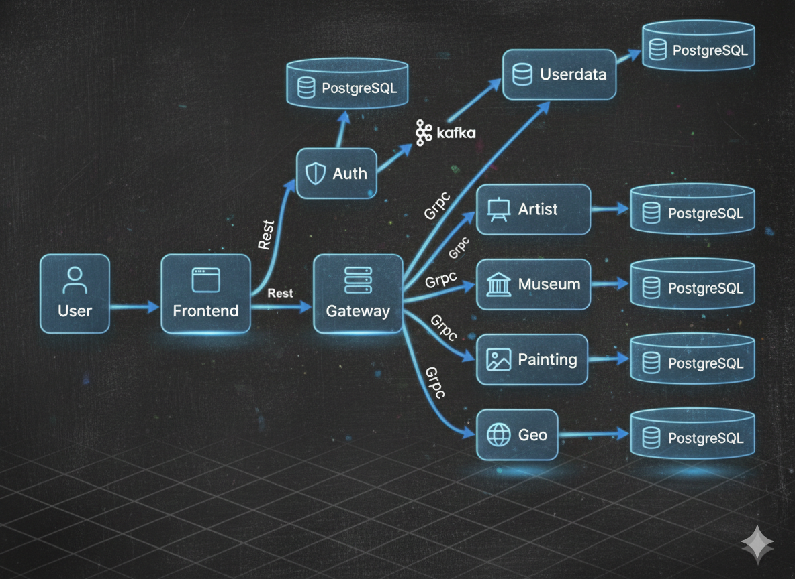

# Проект Rococo

## О проекте

В рамках проекта с нуля был разработан backend для уже готового frontend-приложения. 
Основная цель — показать полный цикл работы с backend-частью сервиса и качественное тестовое покрытие. 

Проект написан на Java 21 с использованием Spring Boot, Spring Data JPA и Gradle. В качестве базы данных используется PostgreSQL, взаимодействие между сервисами реализовано через gRPC.

Отдельное внимание уделено тестированию. В проекте реализованы:
* юнит-тесты,
* интеграционные тесты,
* end-to-end тесты, 

что позволяет уверенно проверять как отдельные компоненты, так и работу системы целиком. 

Для тестирования используются JUnit 5, Mockito, WireMock, RestAssured и Selenide. Отчеты строятся в Allure.

**Схема проекта Rococo**



# Настройка проекта
#### 1. Установить docker (Если не установлен)
#### 2. Спуллить контейнер postgres:15.1, zookeeper и kafka версии 7.3.2

```posh
docker pull postgres:15.1
docker pull confluentinc/cp-zookeeper:7.3.2
docker pull confluentinc/cp-kafka:7.3.2
```

После `pull` вы увидите спуленный image командой `docker images`

```posh
MacBook-Pro ~ % docker images            
REPOSITORY                 TAG              IMAGE ID       CREATED         SIZE
postgres                   15.1             9f3ec01f884d   10 days ago     379MB
confluentinc/cp-kafka      7.3.2            db97697f6e28   12 months ago   457MB
confluentinc/cp-zookeeper  7.3.2            6fe5551964f5   7 years ago     451MB

```

#### 3. Создать volume для сохранения данных из БД в docker на вашем компьютере

```posh
docker volume create pgdata
```

#### 4. Запустить БД, zookeeper и kafka 3-мя последовательными командами:

Запустив скрипт (Для Windows необходимо использовать bash terminal: gitbash, cygwin или wsl)

```posh
User-MacBook-Pro  rococo % bash localenv.sh
```

Или выполнив последовательно команды, для *nix:

```posh
docker run --name rococo-all -p 5432:5432 -e POSTGRES_PASSWORD=secret -v pgdata:/var/lib/postgresql/data -v ./postgres/script:/docker-entrypoint-initdb.d -e CREATE_DATABASES=rococo-auth,rococo-artist,rococo-geo,rococo-museum,rococo-painting,rococo-userdata -e TZ=GMT+3 -e PGTZ=GMT+3 -d postgres:15.1 --max_prepared_transactions=100

docker run --name=zookeeper -e ZOOKEEPER_CLIENT_PORT=2181 -p 2181:2181 -d confluentinc/cp-zookeeper:7.3.2

docker run --name=kafka -e KAFKA_BROKER_ID=1 \
-e KAFKA_ZOOKEEPER_CONNECT=$(docker inspect zookeeper --format='{{ .NetworkSettings.IPAddress }}'):2181 \
-e KAFKA_ADVERTISED_LISTENERS=PLAINTEXT://localhost:9092 \
-e KAFKA_OFFSETS_TOPIC_REPLICATION_FACTOR=1 \
-e KAFKA_TRANSACTION_STATE_LOG_MIN_ISR=1 \
-e KAFKA_TRANSACTION_STATE_LOG_REPLICATION_FACTOR=1 \
-p 9092:9092 -d confluentinc/cp-kafka:7.3.2
```

Для Windows (Необходимо использовать bash terminal: gitbash, cygwin или wsl):

```posh
docker run --name rococo-all -p 5432:5432 -e POSTGRES_PASSWORD=secret -e CREATE_DATABASES=rococo-auth,rococo-artist,rococo-geo,rococo-museum,rococo-painting,rococo-userdata -e TZ=GMT+3 -e PGTZ=GMT+3 -v pgdata:/var/lib/postgresql/data -v ./postgres/script:/docker-entrypoint-initdb.d -d postgres:15.1 --max_prepared_transactions=100

docker run --name=zookeeper -e ZOOKEEPER_CLIENT_PORT=2181 -p 2181:2181 -d confluentinc/cp-zookeeper:7.3.2

docker run --name=kafka -e KAFKA_BROKER_ID=1 -e KAFKA_ZOOKEEPER_CONNECT=$(docker inspect zookeeper --format="{{ .NetworkSettings.IPAddress }}"):2181 -e KAFKA_ADVERTISED_LISTENERS=PLAINTEXT://localhost:9092 -e KAFKA_OFFSETS_TOPIC_REPLICATION_FACTOR=1 -e KAFKA_TRANSACTION_STATE_LOG_MIN_ISR=1 -e KAFKA_TRANSACTION_STATE_LOG_REPLICATION_FACTOR=1 -p 9092:9092 -d confluentinc/cp-kafka:7.3.2
```


Если вы используете Windows и контейнер с БД не стартует с ошибкой в логе:

```
server started
/usr/local/bin/docker-entrypoint.sh: running /docker-entrypoint-initdb.d/init-database.sh
/usr/local/bin/docker-entrypoint.sh: /docker-entrypoint-initdb.d/init-database.sh: /bin/bash^M: bad interpreter: No such file or directory
```

То необходимо выполнить следующие команды в каталоге /postgres/script :

```
sed -i -e 's/\r$//' init-database.sh
chmod +x init-database.sh
```

необходимо проверить, было ли сообщение об автоматическом создании баз данныхз в логе контейнера с Postgres (rococo-all):
```posh
docker logs -f rococo-all
... 
Multiple database creation requested: rococo-auth,rococo-artist,rococo-geo,rococo-museum,rococo-painting,rococo-userdata"
...
```
Если сообщения нет, то необходимо создать базы данных вручную (при этом, мы создаем только пустые БД, без таблиц):
- Установить одну из программ для визуальной работы с Postgres. Например, PgAdmin, DBeaver или Datagrip.
- Подключиться к БД postgres (host: localhost, port: 5432, user: postgres, pass: secret, database name: postgres) из PgAdmin и создать пустые БД микросервисов
```sql
   create database "rococo-auth" with owner postgres;
   create database "rococo-artist" with owner postgres;
   create database "rococo-geo" with owner postgres;
   create database "rococo-museum" with owner postgres;
   create database "rococo-painting" with owner postgres;
   create database "rococo-userdata" with owner postgres;
```

#### 5. Установить Java версии 21. 
#### 6. Установить пакетый менеджер для сборки front-end npm


# Запуск Rococo локальное в IDE:

#### 1. Запусти фронт Rococо:

```posh
User-MacBook-Pro rococo % cd rococo-client
User-MacBook-Pro rococo-client % npm i
User-MacBook-Pro rococo-client % npm run dev
```

  Фронт стартанет на порту 3000: http://127.0.0.1:3000/

#### 2. Прописать run конфигурацию для всех сервисов rococo-* - Active profiles local

Для этого зайти в меню Run -> Edit Configurations -> выбрать main класс -> указать Active profiles: local

#### 4 Запустить сервис Rococo-auth c помощью gradle или командой Run в IDE:

- Запустить сервис auth

```posh
User-MacBook-Pro rococo % cd rococo-auth
User-MacBook-Pro rococo-auth % gradle bootRun --args='--spring.profiles.active=local'
```

Или просто перейдя к main-классу приложения RococoAuthApplication выбрать run в IDEA (предварительно удостовериться что
выполнен предыдущий пункт)

#### 5  Запустить в любой последовательности другие сервисы: rococo-artist,rococo-geo,rococo-museum,rococo-painting,rococo-userdata

Фронтенд Rococo при запуске локально будет работать для вас по адресу http://127.0.0.1:3000/,


